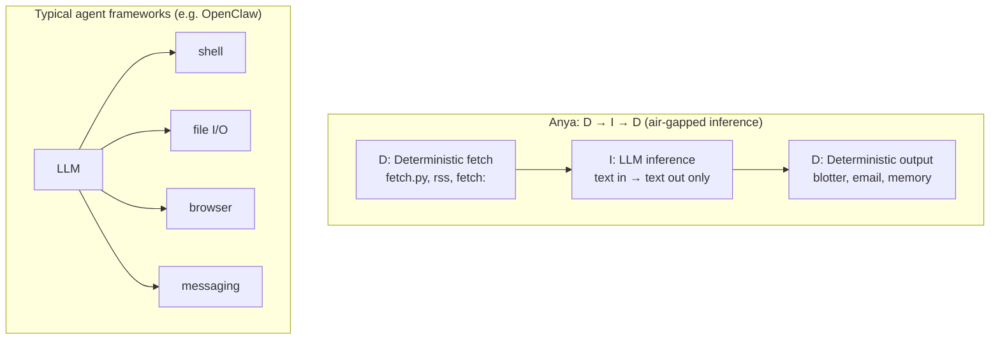

Anya. Headless LLM agent runner: scheduled jobs, skills/flows, email reports, blotter. **Read-only** in intent—no destructive actions. Supports Anthropic Claude and OpenAI-compatible APIs (e.g. mlx_lm.server).

Your Anya has jobs. Each job is a DAG that combines Deterministic Actions (D) and (multimodel) LLM inference (I). The general shape is D → I → D: deterministic fetch/gather, then inference, then deterministic output handling. **Potentially destructive actions stay out of the I stages**—the LLM produces text only; it never has direct tool-calling. Anya's executor enforces an air gap: inference output flows through a controlled pipeline (blotter, email, memory) rather than to arbitrary shell, file, or browser actions. This contrasts with agent frameworks like [OpenClaw](https://dev.to/curi0us_dev/openclaw-security-risks-top-threats-and-practical-mitigations-5e7n), where the LLM directly invokes tools—broad permissions plus prompt injection or malicious skills can chain into real-world impact. Anya's design reduces that surface: the executor is the single, auditable boundary between inference and the outside world.



# Install

```bash
uv init
source .venv/bin/activate
uv pip install -U .
```

# Quick start

1. Set env: `ANTHROPIC_API_KEY` (for Claude), or for OpenAI-compatible: `LLM_PROVIDER=openai`, `LLM_MODEL=<model>`, `LLM_BASE_URL` (default `http://localhost:8080/v1`). Also `UNOSEND_API_KEY`, `UNOSEND_FROM` (e.g. `Anya <anya@yourdomain.com>`)
2. Create jobs in `job/` — one dir per job, each with `MAIN.md`
3. Run once: `anya run --email_to=you@example.com`
4. Or serve (daily): `anya serve --email_to=you@example.com --interval=86400`
5. Run example job too: `anya run --phases=default,ignore`

In reality I'd use 1password, so

```
op run --no-masking --env-file=.env -- anya run --email_to=uche@ogbuji.net 
```

## LLM providers

| Provider | Env | Capability |
|----------|-----|------------|
| **anthropic** (default) | `ANTHROPIC_API_KEY`, optional `LLM_MODEL` | Full support; future features (tools, extended thinking) when added |
| **openai** | `LLM_PROVIDER=openai`, `LLM_MODEL` (required), `LLM_BASE_URL` or `OPENAI_API_BASE` (default `http://localhost:8080/v1`) | Core text-in/text-out; no Anthropic-specific features |

Example with mlx_lm.server:

```bash
# Terminal 1: start mlx server
mlx_lm.server --model mlx-community/Mistral-7B-Instruct-v0.3-4bit

# Terminal 2: run Anya
LLM_PROVIDER=openai LLM_MODEL=mlx-community/Mistral-7B-Instruct-v0.3-4bit anya run --email_to=you@example.com
```

CLI overrides: `--provider`, `--model`, `--llm_base_url`.

```sh
op run --no-masking --env-file=.env -- anya run --provider=openai --llm_base_url=http://localhost:8080/ --model=mlx-community/Qwen3-Coder-30B-A3B-Instruct-4bit --email_to=uche@ogbuji.net
```

# Job structure

```
job/
  my-job/
    MAIN.md      # Core prompt, instructions, optional fetch: / rss: lines
    .env         # Optional; per-job env (API keys, etc.)
    fetch.py     # Optional; runs before Claude, stdout → context
    *.py         # Any .py files run (read-only data gathering)
```

Use `anya.fetchers` in job .py files for pluggable web fetching (HTML→Markdown):

```python
import asyncio
from anya.fetchers import fetch_url, create_fetcher, FetchResult

async def run():
    result = await fetch_url('https://example.com')
    print(result.markdown)  # FetchResult has .markdown, .title, .success

    # For bot-blocked sites (e.g. Reddit): use crawl4ai
    fetcher = create_fetcher('crawl4ai')  # or 'plain' for simple HTTP
    result = await fetcher.fetch('https://reddit.com/...')
asyncio.run(run())
```

**Fetch methods**: `plain` (default) — simple HTTP + ogbujipt; `crawl4ai` — Crawl4AI service for JS-heavy or bot-blocked sites. For crawl4ai, run `docker run -p 11235:11235 unclecode/crawl4ai:basic` and optionally set `CRAWL4AI_BASE_URL`.

More fully:

```sh
docker run -d -p 11235:11235 --name crawl4ai --shm-size=1g unclecode/crawl4ai:latest
```

## MAIN.md

- **id**: optional; overrides dir name for blotter/email (default: dir name)
- **phase**: `default` (default) or `ignore`; `ignore` jobs are skipped unless `--phases` includes them
- **frequency**: `daily` (default), `weekly`, `sundays`, `saturday`, `weekday`
- **fetch: https://...** — fetch URL, body → context
- **rss: https://...** — RSS/Atom feed → context
- **Inline actions** — `---ACTION---` blocks expand before the LLM runs:
  `---ACTION---`\n`fetch('https://example.com/')`\n`---END ACTION---` → replaced with page content as Markdown
- Rest is the prompt for the LLM

## Blotter & memory

- **Blotter** (`data/blotter.txt` by default): append-only log for review. Set `BLOTTER_FILE` env or `--blotter` CLI to share with other agent systems. Uses file locking (`{blotter}.lock`); `BLOTTER_LOCK_TIMEOUT` (default 30s) — if lock cannot be acquired, reports a system issue for you to investigate (e.g. stale lock file)
- **Memory** (`data/memory.txt`): long-term; the LLM can append via `---MEMORY---` block, or prune resolved issues via `---RESOLVED---` block

# Scheduler

Default: asyncio loop (`anya serve --scheduler=asyncio`). Optional: `uv pip install anya[scheduler-apscheduler]` then `anya serve --scheduler=apscheduler`. Scheduler is modular — implement `anya.scheduler.base.Scheduler` to plug in cron, python-crontab, schedule, etc.

# Conventions

See `AICONTEXT-PYLIB.md` for Python style and tooling.
