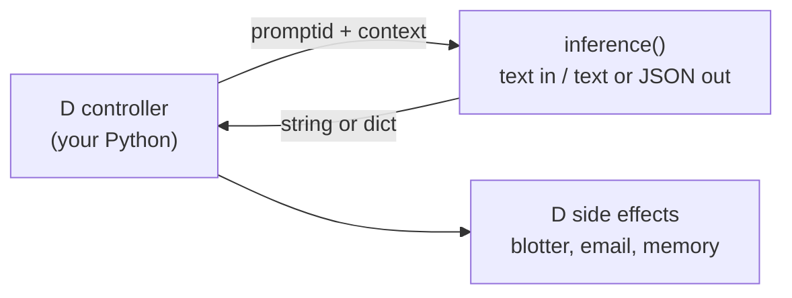
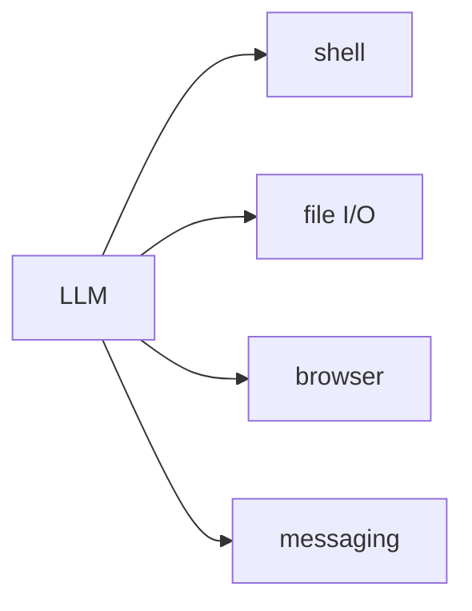

Anya. Headless LLM agent runner: scheduled jobs, deterministic controllers, email reports, blotter. **Read-only** in intent—no destructive actions. Preferred backends are **OpenRouter** (cloud, broad model selection) and **local OpenAI-compatible servers** (e.g. oMLX). Anthropic direct is also supported.

Your Anya has jobs. Each job is a **deterministic controller** (Python) that gathers data, calls `inference()` to ask an LLM specific questions, and produces a report. The LLM never invokes tools and never takes actions; it's text-in / text-or-JSON-out. Destructive actions only exist in controller code. Compare with agent frameworks like [OpenClaw](https://dev.to/curi0us_dev/openclaw-security-risks-top-threats-and-practical-mitigations-5e7n), where the LLM directly invokes tools—broad permissions plus prompt injection or malicious skills can chain into real-world impact. Anya's design reduces that threat surface: every controller is the deterministic boundary between inference and the outside world.

**Anya (controller-driven, air-gapped at the inference boundary):**


```mermaid
flowchart LR
    C["D controller<br/>(your Python)"]
    I["inference()<br/>text in / text or JSON out"]
    C -- "promptid + context" --> I
    I -- "string or dict" --> C
    C --> O["D side effects<br/>blotter, email, memory"]
```

**Typical agent (e.g. OpenClaw):**


```mermaid
flowchart LR
    I2["LLM"] --> T1["shell"]
    I2 --> T2["file I/O"]
    I2 --> T3["browser"]
    I2 --> T4["messaging"]
```

The controller author bears the responsibility of treating inference output as **untrusted input**: any LLM output that drives control flow (loops, file paths, URL choices) must be schema-constrained AND validated against pre-fetched allow-lists. The dispatcher refuses tool-call kwargs at the code level as a belt-and-suspenders.

# Install

```bash
uv init
source .venv/bin/activate
uv pip install -U .
```

# Quick start

1. Create `config.toml` (copy `config.example.toml`) with at least one model backend. This is **required** — it's the single source of truth for all non-secret settings (model aliases/backends, email recipients/provider/sender, fetcher knobs, paths).
2. Set **secrets** in env — only API keys live here. Pick the key your backends resolve to: `OPENROUTER_API_KEY` (preferred), `ANTHROPIC_API_KEY`, or `OPENAI_API_KEY`; plus the email provider key (default Resend): `RESEND_API_KEY`. A backend may reference a key in `config.toml` as `api_key = "${OPENROUTER_API_KEY}"` (a literal key there logs a warning).
3. Create jobs in `job/` — one dir per job, each with `anya.toml` + `controller.py` + `anya.loom.toml`
4. Run once: `anya run` (recipients come from `config.toml [email] to`; `--email_to=you@example.com` overrides)
5. Or serve (daily): `anya serve --interval=86400`
6. Run example job too: `anya run --phases=default,ignore`
7. Dev: run one job (ignores frequency): `anya run --select-jobs=my-job`

In reality I'd use 1password, so

```
op run --env-file=.env -- anya run --email_to=uche@example.com
```

## LLM providers and `config.toml`

`config.toml` (top-level, alongside `job/`) maps **model aliases** to **backends**. A controller calls `inference('summarize', context=..., model='cheapest')` and the alias is resolved here.

```toml
[models]
default = "fast"                     # used when inference() omits model=

[models.aliases]
fast = "or-haiku"
best-reasoning = "or-opus"
cheapest = "local-qwen"

# OpenRouter: cloud, broad model menu. `provider = "openrouter"` is sugar
# that fills in base_url and picks up OPENROUTER_API_KEY from env.
[models.backends.or-haiku]
provider = "openrouter"
model = "anthropic/claude-haiku-4.5"

[models.backends.or-opus]
provider = "openrouter"
model = "anthropic/claude-opus-4.7"

[models.backends.or-llama]
provider = "openrouter"
model = "meta-llama/llama-3.3-70b-instruct"

# Local: any OpenAI-compatible server. oMLX is the preferred local runner —
# use a grammar-capable build for native JSON-schema support.
[models.backends.local-qwen]
provider = "openai"
model = "qwen3.6-mlx"
base_url = "http://localhost:8080/v1"

# Anthropic direct, if you don't want to go through OpenRouter.
[models.backends.claude-haiku-direct]
provider = "anthropic"
model = "claude-haiku-4-5-20251001"
```

A `config.toml` defining at least one `[models.backends.*]` is **required** — there's no env-var fallback for synthesizing a backend. Anya resolves it from `--config`, then `$ANYA_CONFIG_FILE`, then `./config.toml`. API keys stay in env; reference them in `config.toml` via `${ENV_VAR}` (a literal secret there logs a warning).

| Provider | config.toml | Capability |
|----------|-------------|------------|
| **openrouter** (preferred cloud) | `provider="openrouter"`, `model="vendor/model-id"`; env `OPENROUTER_API_KEY` | Text + `response_format` JSON schema (per-model; controller's post-hoc retry covers the rest) |
| **openai** (local servers + cloud OpenAI) | `provider="openai"`, `model`, `base_url`, env `OPENAI_API_KEY` (optional for local) | Text + `response_format` JSON schema. For local: oMLX (grammar-capable build), vLLM, etc. |
| **anthropic** (direct) | `provider="anthropic"`, `model`, env `ANTHROPIC_API_KEY` | Text + structured output (tool-use coercion) |

`mlx_lm` is no longer supported; use an oMLX deployment fronted as an OpenAI-compatible server.

# Job structure

```
job/
  _lib/            # optional: shared Python code, importable from any controller
    hunt.py
  my-job/
    anya.toml      # job metadata
    controller.py  # entry point (D Python program)
    anya.loom.toml # WordLoom prompt file (.loom.toml so editors pick up TOML mode)
    .env           # optional per-job env
```

A `_`-prefixed directory under `job/` (by convention `_lib/`) is **shared code, not a job** — job discovery skips it. When a `_lib/` exists, the executor puts the `job/` root on each controller's `PYTHONPATH`, so any controller can `from _lib import hunt` (or whatever modules you put there) to reuse logic across jobs without copy-paste. Like the rest of `job/`, `_lib/` is gitignored by default — handy for keeping job-specific or proprietary helpers out of the repo.

## `anya.toml`

```toml
title       = "..."
description = "..."
frequency   = "daily"        # daily | weekly | sundays | saturday | weekday
phase       = "default"      # default | ignore (ignore = skip unless --phases includes it)
entry       = "controller.py"
type        = "pymain"       # only pymain supported today
prompts     = "anya.loom.toml"  # optional; defaults to anya.loom.toml
id          = "..."          # optional; overrides dir name for blotter/email
select      = 3              # optional; exposed to the controller as ANYA_JOB_SELECT
```

CLI job filters (on top of `--phases`): `--select-jobs=id1,id2` runs only those jobs and bypasses frequency; `--exclude-jobs=id1` skips them.

## `controller.py`

A regular Python program. It runs as a subprocess with these env vars set:

- `ANYA_JOB_ID`, `ANYA_JOB_PATH`
- `ANYA_PROMPTS_FILE` (resolved path to `anya.loom.toml`)
- `ANYA_CONFIG_FILE` (resolved path to `config.toml`, if any)
- `ANYA_JOB_SELECT` (when `select` is set)

Whatever the controller prints to stdout becomes the job's report (emailed and blottered). The controller may emit `---MEMORY---` / `---END MEMORY---` and `---RESOLVED---` / `---END RESOLVED---` blocks to drive long-term memory; those are stripped from the user-facing report.

```python
import asyncio
from anya import inference
from anya.fetchers import fetch_url

async def main():
    page = await fetch_url('https://example.com')
    report = await inference('summarize', context={'data': page.markdown})
    print(report)

asyncio.run(main())
```

### `inference()` API

```python
inference(promptid, context, *, model=None, system=None,
          response_schema=None, max_tokens=4096, temperature=None, now=None) -> str | dict
```

- `promptid`: WordLoom key in the prompts file
- `context`: template params for the prompt (`str.format` substitution)
- `model`: alias or backend name from `config.toml`; falls back to the configured default
- `response_schema`: optional JSON schema; when set, returns a parsed `dict` (with native backend support where available, post-hoc parse-and-retry as a fallback)
- `now`: overrides "today" (defaults to `date.today()`). The current date is appended to the system prompt on every call — providers don't set it and the model's training prior otherwise guesses an earlier year, so prompts can reason about deadlines / "recent" / relative dates without each job plumbing the date in. Pass a fixed date for deterministic tests.
- `tools=` / `tool_choice=` / `functions=` etc. are **refused** at dispatch time

## `anya.loom.toml` (WordLoom prompts)

Standard [WordLoom](https://github.com/OoriData/WordLoom) format. Keys are promptids; `_m` declares template markers. The file/dir/glob inclusion feature is enabled — see the [WordLoom implementation doc](https://github.com/OoriData/WordLoom/blob/main/implementation.md) for how to pull in supporting text without controller boilerplate.

```toml
lang = 'en'

[summarize]
_ = '''
Summarize the data below.

## Fetched content
{data}
'''
_m = ['data']
```

## Fetchers

`anya.fetchers` for pluggable web fetching (HTML→Markdown):

```python
from anya.fetchers import fetch_url, create_fetcher

result = await fetch_url('https://example.com')           # plain HTTP
# Or for bot-blocked sites:
result = await create_fetcher('crawl4ai').fetch('https://reddit.com/...')
```

**Fetch methods**:

- `plain` (default) — simple HTTP + ogbujipt
- `rss` — RSS/Atom feed via `feedparser`; returns a markdown summary of feed entries
- `reddit` — rewrites any `*.reddit.com` URL (including `www.`) to `old.reddit.com` and sends a real User-Agent; falls back to the URL's `.rss` feed when blocked. Set `config.toml [fetch] reddit_user_agent` to override the default UA (Reddit's API guidelines ask the UA to identify your bot)
- `crawl4ai` — Crawl4AI service for JS-heavy or bot-blocked sites. Run `docker run -p 11235:11235 unclecode/crawl4ai:basic` and set `config.toml [fetch] crawl4ai_base_url` if not on the default `http://localhost:11235`

All GET fetchers share an HTTP cache (hishel, RFC 9111) so we send `If-None-Match` / `If-Modified-Since` on revalidation and honor `Cache-Control` / `Vary` — be a good HTTP citizen. SQLite-backed, default at `data/http-cache.sqlite`; set `config.toml [paths] http_cache` to relocate. Delete the file to clear the cache.

### Search ("SERP") fetchers

For jobs that discover pages by **searching** rather than crawling a fixed listing, `anya.fetchers` also exposes query-based searchers. They take a query (not a URL) and return a `FetchResult` whose markdown lists each result's title, URL, and snippet — which drops straight into the same extract→validate pipeline (the result URLs serve as the allow-list).

```python
from anya.fetchers import search_web, create_searcher

result = await search_web('SMBs hiring RevOps mentioning HubSpot', provider='tavily')
# or: result = await create_searcher('brave').search('...')
```

| Provider | Secret (env) | Result-count knob (`config.toml [fetch]`) |
|----------|--------------|-------------------------------------------|
| **tavily** | `TAVILY_API_KEY` | `tavily_max_results` (default 10) |
| **brave** | `BRAVE_API_KEY` | `brave_max_results` (default 10) |

A missing key is a soft failure (`success=False` with a logged warning), not a crash — so one unconfigured provider doesn't abort a multi-source run. Searchers don't use the shared HTTP cache (search results are time-sensitive and metered per call).

For **Reddit** as a query source, no special searcher is needed: point the existing `reddit` fetcher at a search URL (e.g. `https://www.reddit.com/r/RevOps/search?q=hubspot&restrict_sr=1&sort=new`) — it rewrites to `old.reddit.com` and falls back to the `.rss` of that search.

## Blotter & memory

- **Blotter** (`data/blotter.txt` by default): append-only log for review. Set `config.toml [paths] blotter` or `--blotter` CLI to share with other agent systems. Uses file locking (`{blotter}.lock`); `config.toml [blotter] lock_timeout` (default 30s).
- **Memory** (`data/memory.txt`, or `config.toml [paths] memory`): long-term; controllers can append via `---MEMORY---` blocks on stdout, or prune resolved issues via `---RESOLVED---` blocks.

# Email providers

Email delivery is pluggable. Non-secret settings live in `config.toml [email]` (`provider`, `to`, `from`); only the API key is a secret and stays in env. Built-in providers:

| Provider | Secret (env) | Notes |
|----------|--------------|-------|
| **resend** (default) | `RESEND_API_KEY` | [Resend API](https://resend.com/docs/api-reference/emails/send-email) |
| **unosend** | `UNOSEND_API_KEY` | |

Select with `config.toml [email] provider = "resend" | "unosend"` (default: `resend`). Add your own by calling `anya.email.register_provider('myprov', send_fn)` where `send_fn` matches the `EmailProvider` protocol — useful for SMTP, SES, etc.

# Scheduler

Default: asyncio loop (`anya serve --scheduler=asyncio`). Optional: `uv pip install anya[scheduler-apscheduler]` then `anya serve --scheduler=apscheduler`. Scheduler is modular — implement `anya.scheduler.base.Scheduler` to plug in cron, python-crontab, schedule, etc.

# Safety model

- **Inference is text-in / text-or-JSON-out.** Tool-call kwargs are refused at the dispatcher level.
- **Side effects live only in controllers.** The blotter/memory/email surfaces are the only egress.
- **Controllers must treat inference output as untrusted input.** Don't `eval` it, don't pass it to a shell, don't construct paths from it. When LLM output drives control flow (loops over LLM-returned URLs, file paths, etc.), constrain it with a schema AND validate it against controller-side allow-lists or pre-fetched candidates.
- **Synthesized reports** may contain prompt-injected content from upstream web data; that's acceptable for human-read email/blotter output, but worth flagging if downstream agents consume Anya output.

See `job/update-check/controller.py` for the fan-out filter pattern (cheap LLM filter per candidate → synthesis over survivors).
